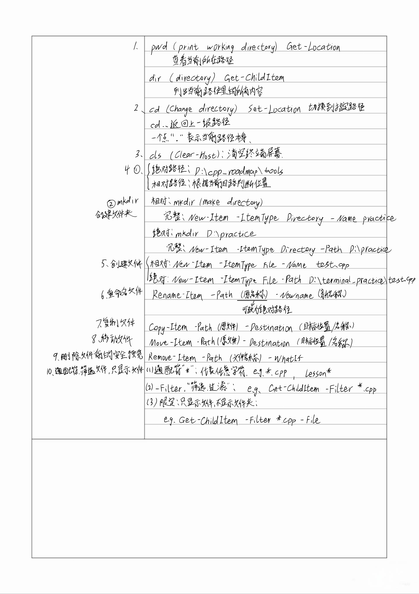
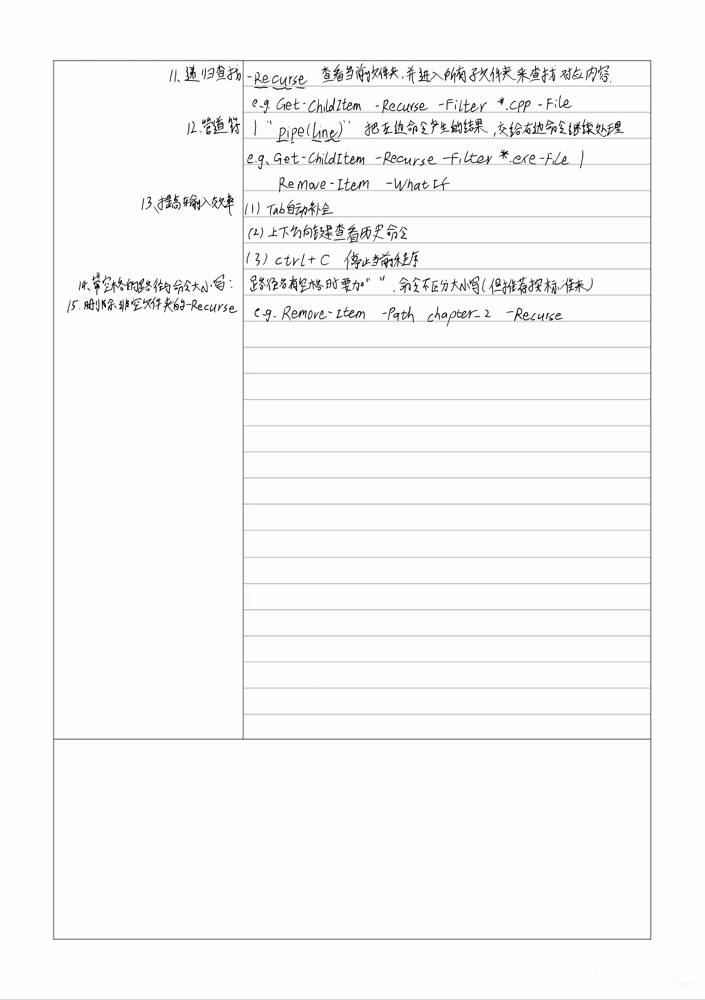

# PowerShell 基础笔记

## 一、终端相关概念

### 1. Terminal 终端

终端是输入命令和查看执行结果的窗口。

VS Code 底部显示下面内容的区域就是终端：

```text
PS D:\cpp_roadmap>
```

终端本身主要负责显示和输入，真正理解命令的是 Shell。

### 2. Shell

Shell 是负责读取、解释和执行命令的程序。

可以把终端理解成银行窗口，把 Shell 理解成窗口后面的操作员。

### 3. PowerShell

PowerShell 是 Windows 上功能完整、现代的 Shell。

目前统一使用 PowerShell 即可，因为它已经能够完成：

查看目录
切换目录
创建文件
重命名文件
复制和移动文件
查找文件
批量清理 `.exe`

PowerShell 提示符通常类似：

```text
PS D:\cpp_roadmap>
```

### 4. CMD

CMD 是 Windows 较老的 Shell。

CMD 和 PowerShell 都能执行一些基础命令，但两者支持的完整命令写法并不完全相同。

### 5. Git Bash

Git Bash 是安装 Git 时通常附带的 Bash 风格 Shell 环境。

它让 Windows 用户可以使用很多类似 Linux Bash 的命令，例如：

```text
ls
cp
mv
rm
```

现阶段不需要同时学习 Git Bash，避免混淆多套命令。

### 6. Git

Git 是版本控制工具，不是终端，也不是 Shell。

Git 可以在 PowerShell、CMD 或 Git Bash 中运行。

例如：

```powershell
git status
```

PowerShell 负责找到并启动 Git，Git 负责检查代码仓库状态。

### 7. Linux Bash 和 WSL

Bash 是 Linux 中常见的 Shell。

WSL 是 Windows 的 Linux 子系统，可以在 Windows 中运行 Linux 环境和 Linux 程序。

现阶段学习 C++ 语法、算法和文件管理，不需要专门学习 WSL。

### 8. 整体关系

```text
用户
↓
VS Code 终端窗口
↓
PowerShell、CMD、Git Bash 等 Shell
↓
Git、g++、Python、exe 等工具或程序
```

## 二、PowerShell 基础概念

### 1. 命令

命令表示让 PowerShell 做什么。

例如：

```powershell
Get-ChildItem
```

表示查看目录中的内容。

### 2. 参数

参数表示让命令按照什么具体要求执行。

例如：

```powershell
Get-ChildItem -File
```

其中：

```text
Get-ChildItem    命令
-File            参数，只显示文件
```

### 3. 当前目录

当前目录是 PowerShell 当前所在的文件夹。

例如：

```text
PS D:\cpp_roadmap>
```

说明当前目录是：

```text
D:\cpp_roadmap
```

没有指定其他路径时，很多命令默认对当前目录进行操作。

### 4. 绝对路径

绝对路径是从盘符开始写出的完整路径。

例如：

```text
D:\cpp_roadmap\tools
```

无论当前位于哪里，它都指向同一个位置。

示例：

```powershell
cd D:\cpp_roadmap\tools
mkdir D:\terminal_practice
```

### 5. 相对路径

相对路径根据当前目录来判断。

假设当前位于：

```text
D:\cpp_roadmap
```

那么：

```powershell
cd tools
```

表示进入当前目录下面的 `tools`。

### 6. 特殊路径符号

```text
.     当前目录
..    上一级目录
```

示例：

```powershell
cd .\tools
cd ..
```

### 7. 通配符

```text
*
```

表示任意数量、任意内容的字符。

示例：

```text
*.cpp    所有以 .cpp 结尾的名称
*.exe    所有以 .exe 结尾的名称
lesson*  所有以 lesson 开头的名称
```

### 8. 路径中的空格

路径或文件名中有空格时，要使用双引号。

正确：

```powershell
cd ".\my notes"
mkdir "D:\my practice"
```

双引号里面的空格属于路径的一部分，不要在路径末尾误加空格。

### 9. 成功后没有输出

很多 PowerShell 命令执行成功后不会显示提示。

例如：

```powershell
Rename-Item -Path test.cpp -NewName main.cpp
```

成功后可能直接回到提示符。

可以使用 `dir` 验证操作结果。

### 10. 大小写

PowerShell 命令通常不区分大小写。

下面写法通常都能运行：

```powershell
Get-ChildItem
get-childitem
GET-CHILDITEM
```

推荐使用规范写法：

```powershell
Get-ChildItem
Rename-Item
Copy-Item
Move-Item
Remove-Item
```

不区分大小写不代表允许拼错单词。

## 三、查看和切换目录

### 查看当前位置

简写：

```powershell
pwd
```

完整写法：

```powershell
Get-Location
```

作用：

```text
显示当前目录
```

### 查看目录内容

简写：

```powershell
dir
```

完整写法：

```powershell
Get-ChildItem
```

作用：

```text
显示当前目录中的文件和文件夹
```

### 切换目录

简写：

```powershell
cd tools
```

完整写法：

```powershell
Set-Location tools
```

进入绝对路径：

```powershell
cd D:\cpp_roadmap\tools
```

返回上一级：

```powershell
cd ..
```

### 清空终端屏幕

简写：

```powershell
cls
```

完整写法：

```powershell
Clear-Host
```

`cls` 只会清除屏幕内容，不会删除文件，也不会改变当前目录。

## 四、创建文件和文件夹

### 创建文件夹

简写：

```powershell
mkdir practice
```

在绝对路径创建：

```powershell
mkdir D:\terminal_practice
```

完整写法：

```powershell
New-Item -ItemType Directory -Name practice
```

参数含义：

```text
New-Item              创建新项目
-ItemType Directory   类型是文件夹
-Name practice        名称是 practice
```

### 创建空文件

```powershell
New-Item -ItemType File -Name test.cpp
```

指定完整路径：

```powershell
New-Item -ItemType File -Path D:\terminal_practice\test.cpp
```

参数含义：

```text
-ItemType File    类型是文件
-Name             指定当前目录中的文件名
-Path             指定文件路径
```

创建的文件内容为空。

## 五、重命名、复制和移动

### 重命名

```powershell
Rename-Item -Path test.cpp -NewName hello.cpp
```

参数含义：

```text
-Path       原文件或文件夹
-NewName    新名称
```

重命名后原名称消失，只剩新名称。

### 复制文件

```powershell
Copy-Item -Path hello.cpp -Destination hello_copy.cpp
```

复制到其他文件夹：

```powershell
Copy-Item -Path hello.cpp -Destination D:\terminal_practice\chapter_2
```

参数含义：

```text
-Path           原文件
-Destination    副本的位置或名称
```

复制后原文件仍然存在。

### 移动文件

```powershell
Move-Item -Path hello.cpp -Destination D:\terminal_practice\chapter_2
```

移动并改名：

```powershell
Move-Item -Path hello.cpp -Destination D:\terminal_practice\chapter_2\main.cpp
```

移动后文件离开原位置。

### 复制和移动的区别

```text
Copy-Item    原文件保留，同时产生副本
Move-Item    文件离开原位置，进入新位置
```

## 六、查找文件

### 查找当前目录的 `.cpp`

```powershell
Get-ChildItem -Filter *.cpp -File
```

### 递归查找全部 `.cpp`

```powershell
Get-ChildItem -Recurse -Filter *.cpp -File
```

### 递归查找全部 `.exe`

```powershell
Get-ChildItem -Recurse -Filter *.exe -File
```

参数含义：

```text
-Recurse       进入所有下级文件夹
-Filter        按规则筛选
*.cpp          匹配所有 .cpp
*.exe          匹配所有 .exe
-File          只显示文件，不显示文件夹
```

## 七、管道符

管道符：

```text
|
```

作用是把左边命令产生的结果交给右边命令继续处理。

示例：

```powershell
Get-ChildItem -Recurse -Filter *.exe -File | Remove-Item -WhatIf
```

执行过程：

```text
递归找到全部 .exe
↓
通过管道交给 Remove-Item
↓
使用 -WhatIf 预览删除
```

## 八、删除文件和文件夹

### 重要提醒

PowerShell 中使用 `Remove-Item` 删除的文件通常不会进入 Windows 回收站。

不要在下面的位置练习批量删除：

```text
C:\
C:\Windows
C:\Program Files
真实项目的重要目录
```

优先在专门建立的测试目录中练习。

### 删除单个文件

预览：

```powershell
Remove-Item -Path test.cpp -WhatIf
```

正式删除：

```powershell
Remove-Item -Path test.cpp
```

### 删除空文件夹

预览：

```powershell
Remove-Item -Path ".\my notes" -WhatIf
```

正式删除：

```powershell
Remove-Item -Path ".\my notes"
```

### 删除非空文件夹

预览：

```powershell
Remove-Item -Path .\chapter_2 -Recurse -WhatIf
```

正式删除：

```powershell
Remove-Item -Path .\chapter_2 -Recurse
```

`-Recurse` 会连同内部文件和子文件夹一起处理，风险较高。

### 安全删除全部 `.exe`

第一步，确认当前位置：

```powershell
pwd
```

第二步，查找准备删除的文件：

```powershell
Get-ChildItem -Recurse -Filter *.exe -File
```

第三步，预览删除：

```powershell
Get-ChildItem -Recurse -Filter *.exe -File | Remove-Item -WhatIf
```

第四步，确认预览内容完全正确。

第五步，正式删除：

```powershell
Get-ChildItem -Recurse -Filter *.exe -File | Remove-Item
```

第六步，再次查找验证：

```powershell
Get-ChildItem -Recurse -Filter *.exe -File
```

固定口诀：

```text
pwd 确认位置
查找确认目标
-WhatIf 预览
正式执行
再次查找验证
```

## 九、辅助操作

### Tab 自动补全

输入命令或路径的一部分，然后按 `Tab`。

例如：

```text
Get-Chi + Tab
```

可能补全为：

```powershell
Get-ChildItem
```

路径也可以补全：

```text
cd cha + Tab
```

可能补全为：

```powershell
cd .\chapter_1
```

### 历史命令

```text
↑    查看更早的命令
↓    返回更新的命令
```

历史命令调出来后不会立即执行，按 Enter 才会执行。

遇到以前的删除命令，不要直接按 Enter，要先检查完整内容。

### Ctrl+C

命令还没有执行时：

```text
Ctrl+C 取消当前输入
```

程序正在运行时：

```text
Ctrl+C 尝试中止当前程序
```

例如 C++ 程序陷入死循环时，可以尝试按 `Ctrl+C`。

## 十、容易混淆的地方

### 终端和 Shell

```text
终端    输入和显示的窗口
Shell   理解并执行命令的程序
```

### Git 和 Git Bash

```text
Git         版本控制工具
Git Bash    Bash 风格的 Shell 环境
```

### `.` 和 `..`

```text
.     当前目录
..    上一级目录
```

### `-File` 和 `-Filter`

```text
-File           只显示文件
-Filter *.cpp   只匹配 .cpp
```

### `Copy-Item` 和 `Move-Item`

```text
Copy-Item    原文件保留
Move-Item    原文件离开原位置
```

### `-Recurse`

用于查找时：

```text
进入所有子文件夹查找
```

用于删除时：

```text
连同内部内容一起删除
```

删除时风险更高。

### `-WhatIf`

```text
只预览准备执行的操作，不真正修改文件
```

## 十一、现阶段命令速查表

| 目标 | 命令 |
|---|---|
| 查看当前位置 | `pwd` |
| 查看目录内容 | `dir` |
| 进入文件夹 | `cd 文件夹名` |
| 返回上一级 | `cd ..` |
| 清空屏幕 | `cls` |
| 创建文件夹 | `mkdir 文件夹名` |
| 创建空文件 | `New-Item -ItemType File -Name 文件名` |
| 重命名 | `Rename-Item -Path 原名称 -NewName 新名称` |
| 复制 | `Copy-Item -Path 原文件 -Destination 目标` |
| 移动 | `Move-Item -Path 原文件 -Destination 目标` |
| 删除单个文件 | `Remove-Item -Path 文件名` |
| 查看 `.cpp` | `Get-ChildItem -Filter *.cpp -File` |
| 递归查找 `.cpp` | `Get-ChildItem -Recurse -Filter *.cpp -File` |
| 递归查找 `.exe` | `Get-ChildItem -Recurse -Filter *.exe -File` |
| 预览删除全部 `.exe` | `Get-ChildItem -Recurse -Filter *.exe -File \| Remove-Item -WhatIf` |
| 正式删除全部 `.exe` | `Get-ChildItem -Recurse -Filter *.exe -File \| Remove-Item` |
| 删除非空文件夹 | `Remove-Item -Path 文件夹 -Recurse` |
| 自动补全 | `Tab` |
| 查看历史命令 | `↑` 和 `↓` |
| 停止程序 | `Ctrl+C` |

