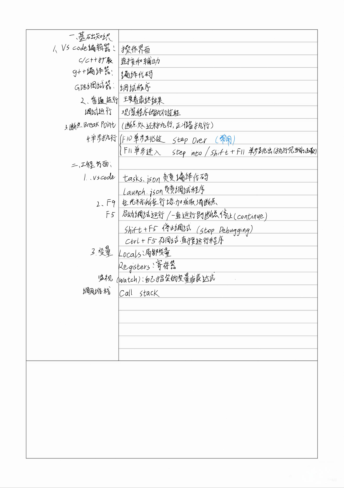

# VS Code C++ 基础调试笔记

## 1. VS Code、g++、GDB、C/C++扩展的关系

VS Code：写代码和显示调试界面的编辑器。

g++：把 `.cpp` 源代码编译成 `.exe` 可执行程序。

GDB：控制并观察 `.exe` 的运行过程，例如暂停、继续、单步执行和查看变量。

Microsoft C/C++扩展：让 VS Code 能调用 g++ 和 GDB，并提供 C++ 代码提示和图形化调试界面。

基本流程：

```text
在 VS Code 中编写 .cpp
→ g++ 编译生成 .exe
→ GDB 控制 .exe 运行
→ VS Code 显示变量、断点和调用堆栈
```

编译调试版本时需要保留调试信息：

```powershell
g++ -g 文件名.cpp -o 文件名.exe
```

## 2. 调试基本流程

```text
1. 保存代码
2. 设置断点
3. 按 F5 启动调试
4. 程序在断点处暂停
5. 查看 Variables 和 Watch
6. 使用 F10 或 F11 单步执行
7. 使用 F5 继续运行
8. 使用 Shift+F5 停止调试
```

黄色高亮所在行通常表示：

```text
这一行正准备执行，还没有执行
```

## 3. 断点 Breakpoint

断点用于让程序运行到指定代码行时暂停。

特点：

- 不会修改代码逻辑
- 不会改变计算结果
- 应设置在能够执行的语句上
- 空行、注释和单独的大括号通常不能停住

在 VS Code 中，断点通常显示为代码行左侧的红色圆点。

## 4. 六个核心快捷键

| 快捷键 | 英文名称 | 作用 |
|---|---|---|
| F9 | Toggle Breakpoint | 添加或取消断点 |
| F5 | Start/Continue | 启动调试；暂停后继续运行到下一个断点 |
| F10 | Step Over | 执行当前行，但不进入当前行调用的函数 |
| F11 | Step Into | 执行当前行，并进入当前行调用的函数 |
| Shift+F11 | Step Out | 执行完当前函数并返回调用位置 |
| Shift+F5 | Stop Debugging | 停止调试 |

使用原则：

```text
怀疑函数内部有问题 → F11
确定函数没问题，只想执行过去 → F10
想快速执行完当前函数 → Shift+F11
```

## 5. 调试界面

### Variables（变量）

自动显示当前位置能够访问的变量及当前值。

局部变量离开作用域后，会从 Variables 中消失。

### Watch（监视）

主动添加需要长期观察的变量或表达式，例如：

```cpp
i
sum
number > 0
number == 0
```

### Call Stack（调用堆栈）

显示程序经过哪些函数来到当前位置。

最上面通常是当前正在执行的函数，下面是调用它的函数。

### Breakpoints（断点）

集中显示当前设置的断点。

### Debug Console（调试控制台）

显示调试信息，也能计算表达式。基础阶段不需要使用 GDB 命令。

### 鼠标悬停

程序暂停时，把鼠标停在变量名上，可以查看变量当前值。

## 6. 循环调试方法

以累加循环为例：

```cpp
for (int i = 1; i <= n; i++)
{
    sum += i;
}
```

调试方法：

```text
1. 在循环体内设置断点
2. 把 i 和 sum 加入 Watch
3. 使用 F10 逐步执行
4. 比较执行前后的 i 和 sum
5. 检查循环起点、结束条件和每轮变化
```

重点检查：

- 初始值是否正确
- 条件是否多一轮或少一轮
- `i++` 是否正确
- 累加变量是否正确初始化
- 边界值是否被错误计入

## 7. 条件判断调试方法

```text
1. 在第一个判断处设置断点
2. 把条件表达式加入 Watch
3. 查看每个条件是 true 还是 false
4. 使用 F10 观察程序进入哪个分支
5. 比较实际分支和预期分支
```

注意：

```text
if / else if / else 中，只会执行第一个满足条件的分支。
前面的条件为 true 后，后面的条件不会再检查。
```

## 8. 函数调试方法

假设：

```cpp
int answer = getMax(x, y);
```

调试方法：

```text
1. 在函数调用行设置断点
2. 按 F11 进入函数
3. 查看形参和局部变量
4. 用 F10 在函数内部逐行执行
5. 在 Call Stack 中查看调用关系
6. 用 Shift+F11 跳出函数
7. 查看返回值和接收返回值的变量
```

调试器有时会临时显示：

```text
$ReturnValue
```

它表示刚刚结束的函数返回了什么，不是代码中定义的普通变量。

## 9. 常见问题排查

### 断点空心、灰色或程序不停

```text
代码是否保存
→ 是否重新编译
→ 编译参数是否有 -g
→ 调试的 .exe 是否对应当前 .cpp
→ 断点是否位于可执行语句
```

### 修改代码后仍运行旧结果

检查是否保存、是否重新编译，以及 F5 是否执行了正确的 `preLaunchTask`。

### 调试运行旧的 exe

检查 `tasks.json` 生成的 `.exe` 路径是否与 `launch.json` 的 `program` 一致。

### 看不到变量值

可能原因：

- 程序没有暂停
- 变量还没有创建
- 变量已经离开作用域
- 编译时没有 `-g`
- 编译优化影响变量观察

### 不知道在哪里输入

当前配置为：

```json
"externalConsole": true
```

所以 `cin` 输入应在弹出的外部控制台中完成，不是在 Debug Console 中输入。

### 程序一启动就结束

可能原因：没有断点、断点没有生效、程序本身执行很快，或程序已经正常结束。

### VS Code 找不到 GDB

先检查：

```powershell
gdb --version
```

再检查 `launch.json` 中的 `miDebuggerPath`。

### tasks.json 和 launch.json 不匹配

需要满足：

```text
tasks.json 的 label
=
launch.json 的 preLaunchTask
```

并且：

```text
tasks.json 生成的 .exe 路径
=
launch.json 中 program 指向的 .exe 路径
```

## 10. 当前暂时不用学

- 条件断点
- 数据断点
- 函数断点
- 内存查看
- 寄存器
- 多线程调试
- 远程调试
- GDB 命令行高级操作
- 崩溃转储
- 大型多文件项目调试

## 11. 简洁速查表

```text
保存代码：Ctrl+S
添加/取消断点：F9
启动或继续调试：F5
执行当前行但不进入函数：F10
进入当前行调用的函数：F11
执行完当前函数并返回：Shift+F11
停止调试：Shift+F5

Variables：自动显示当前变量
Watch：主动监视变量或表达式
Call Stack：查看函数调用关系
Breakpoints：管理断点
Debug Console：查看调试信息

黄色高亮：当前正准备执行的代码行
红色圆点：断点
-g：保留变量名、行号等调试信息
```
